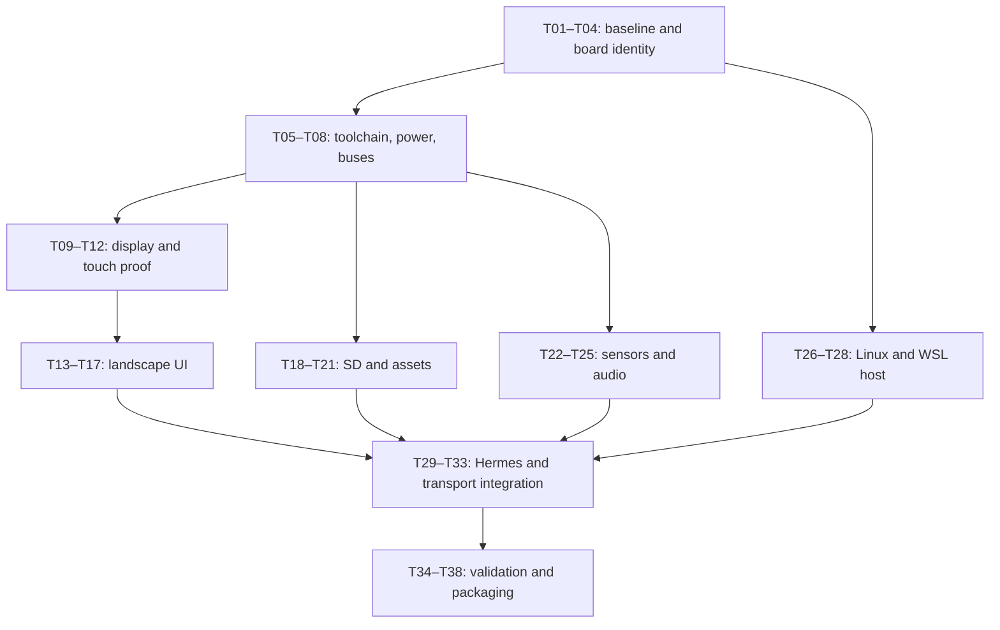

**Hermes Familiar migration plan — Waveshare ESP32-S3-Touch-LCD-3.49 V1**

Prepared 2026-09-27 against Hermes commit `9d69262c7c3efb83bb84eadf3bf4bf0fb13089f9`.
This is an implementation backlog; checked tasks have recorded evidence, while unchecked tasks may be partial or pending.

Target: the user's V1 board, USB at `/dev/ttyACM0`, with **640 × 172 landscape UI** as explicitly selected. The development environment is WSL2. The migration should preserve the existing familiar's behavior: animated face, messages, six action buttons, approvals, status pages, chirps, speech playback, SD assets, motion gestures, and USB/network connectivity.

The proposed approach is to retain the Arduino application and Hermes JSON protocol, introduce a V1 board implementation, and render the landscape UI through Waveshare's AXS15231B display path. Keep the existing 2.8-inch build available so board work does not unnecessarily diverge from upstream. Microphone recording, a portrait UI, and new agent features are separate enhancements; the current application does not implement microphone capture.

**Evidence that determines the work**

The original application uses a 240 × 320 ST7789 SPI panel, CST328 touch, direct GPIO power hold, and a 320 × 240 landscape layout in `src/main.cpp`. Assets and export scripts assume 240 × 320 frames. Hardware setup, presentation, protocol parsing, and peripheral control share the same approximately 2,000-line translation unit.

For the target, the manufacturer-provided V1 sources were inspected at commit `def6edd0b6e1925ed09702eed01a2f181afdf8c1` in [Waveshare's example repository](https://github.com/waveshareteam/ESP32-S3-Touch-LCD-3.49/tree/def6edd0b6e1925ed09702eed01a2f181afdf8c1/Examples/Arduino). These values are source-backed starting points, not measurements of the attached board:

| Subsystem | Current Hermes firmware | Target V1 reference |
| --- | --- | --- |
| LCD | ST7789, ordinary SPI, 240 × 320 | AXS15231B, QSPI, native 172 × 640; logical 640 × 172 |
| LCD pins | MOSI 45, SCLK 40, CS 42, DC 41, RESET 39 | CS 9, CLK 10, D0–D3 11/12/13/14, RESET 21; no separate DC pin |
| Backlight | GPIO5 | PWM GPIO8; reconcile the schematic's separate enable signal during board setup |
| Touch | CST328 at 0x1A, SDA1/SCL3, INT4/RESET2; additional LovyanGFX fallback | AXS15231B touch at 0x3B, SDA17/SCL18; vendor configuration has no MCU touch INT or reset pin |
| Peripheral I2C | SDA11/SCL10 with a scan that also tries the reverse | SDA47/SCL48, shared by sensors, expander, and codecs |
| Power | Key GPIO6; hold GPIO7 | Power key GPIO16; TCA9554 output P6 holds system power; BOOT remains GPIO0 |
| SD, one-bit SDMMC | CLK14/CMD17/D0=16; GPIO21 enable | CLK41/CMD39/D0=40; do not carry over the old GPIO21 enable |
| Battery | GPIO8; divider ×2 and a board-specific correction | ADC1 channel 3 (GPIO4); vendor example uses divider ×3 |
| Audio | Legacy I2S TX: BCLK48/LRCK38/DOUT47 | ES8311 playback: MCLK7/BCLK15/LRCK46/DOUT45; ES7210 input uses DIN6; expander P7 is enabled in the audio example |
| IMU and RTC | QMI8658 and PCF85063 | Same chip families, different bus wiring; validate addressing, initialization, and motion axes |

The LCD/touch mapping comes from the V1 [user configuration](https://github.com/waveshareteam/ESP32-S3-Touch-LCD-3.49/blob/def6edd0b6e1925ed09702eed01a2f181afdf8c1/Examples/Arduino/09_LVGL_V8_Test/user_config.h). Power, SD, ADC, and audio mappings come from the corresponding `07_BATT_PWR_Test`, `04_SD_Card`, `01_ADC_Test`, and `08_Audio_Test` examples; the audio board entry is in `src/codec_board/board_cfg.h`, while the accompanying `.txt` file lacks that entry. Cross-check control polarities and expander signals against the [V1 schematic](https://files.waveshare.com/wiki/ESP32-S3-Touch-LCD-3.49/ESP32-S3-Touch-LCD-3.49-Schematic.pdf) before implementation.

Waveshare identifies `Rev1.1` as V2. This plan targets the user's stated V1; the PCB revision and full hardware inventory still need to be recorded. The [version notes](https://docs.waveshare.com/ESP32-S3-Touch-LCD-3.49/Resources-And-Documents) explain the changed reset, backlight, and related signals.

Two less visible differences matter:

- The vendor [display port](https://github.com/waveshareteam/ESP32-S3-Touch-LCD-3.49/blob/def6edd0b6e1925ed09702eed01a2f181afdf8c1/Examples/Arduino/09_LVGL_V8_Test/lvgl_port.c) rotates a full frame in software and sends sequential DMA chunks. Its [QSPI panel driver](https://github.com/waveshareteam/ESP32-S3-Touch-LCD-3.49/blob/def6edd0b6e1925ed09702eed01a2f181afdf8c1/Examples/Arduino/09_LVGL_V8_Test/src/axs15231b/esp_lcd_axs15231b.c) skips the usual row-address command and uses RAMWR/RAMWRC streaming. Arbitrary direct rectangle writes cannot be assumed to behave like the ST7789.
- `plugin/voice.py` invokes macOS `afconvert`, and `scripts/run_bridge.sh` contains the author's absolute Python path. Linux/WSL speech and the fallback launcher therefore need explicit portability work. Speech is fetched over Wi-Fi even when control uses USB; the ESP32 must be able to reach the advertised host HTTP address.

**Architecture decisions to validate early**

Keep PlatformIO as the preferred build entry point. The V1 environment `waveshare_esp32_s3_touch_lcd_349_v1` now selects pioarduino platform release 55.03.30, Arduino ESP32 3.3.0 / ESP-IDF 5.5.0, LovyanGFX 1.2.30, NimBLE-Arduino 2.3.6, and ArduinoJson 7.4.2; the original `waveshare_esp32_s3_touch_lcd_28` environment remains available. Earlier builds of both environments passed, but the current integration build still needs verification. [Waveshare Arduino requirements](https://docs.waveshare.com/ESP32-S3-Touch-LCD-3.49/Arduino)

Use Waveshare's `esp_lcd` AXS15231B implementation for physical display transfers. The first renderer candidate is a 16-bit LovyanGFX **offscreen sprite**, keeping familiar drawing primitives while removing LovyanGFX's ST7789 bus, panel, backlight, and touch configuration from the V1 build. LovyanGFX supports a parentless sprite with a retrievable buffer; that does not establish compatibility with the selected complete firmware stack. [LovyanGFX sprite source](https://github.com/lovyan03/LovyanGFX/blob/master/src/lgfx/v1/LGFX_Sprite.hpp)

T09 is the renderer decision gate: prove that offscreen drawing, the selected core, and the vendor display driver work together. If that path cannot be made coherent without maintaining a graphics-library fork, use the vendor LVGL 8 display path and implement the same UI specification there. Resolve this before porting all pages; do not maintain both new renderers.

Assign one owner to each I2C controller and use a consistent driver family. The proposed V1 board layer owns the ESP-IDF master buses, with clients sharing registered device handles. Adapt existing sensor access and codec control to those buses. Do not initialize a second `Wire` or vendor bus on the same controller. Espressif explicitly says the legacy and new I2C drivers cannot coexist. [ESP-IDF 5.5 I2C documentation](https://docs.espressif.com/projects/esp-idf/en/v5.5/esp32s3/api-reference/peripherals/i2c.html)

The proposed code boundaries are deliberately limited to the migration:

```text
src/main.cpp                  startup order and scheduling
src/boards/                   board selection, pins, power, I2C ownership
src/display/                  selected renderer adapter, AXS15231B transfers
src/input/                    AXS15231B touch decoding and coordinates
src/ui/                       layout, drawing, hit regions, assets
src/audio/                    codec initialization and playback ownership
src/protocol/                 state/events and bounded JSON input handling
lib/                          only required vendor drivers, with provenance
```

Extract these boundaries as each subsystem is ported; avoid a preliminary rewrite of unrelated host/plugin code. The Python plugin, standalone bridge, and iOS client should continue using the same existing messages. Optional board/capability metadata can be added to the hello frame without changing the established command fields.

**Task sequence and completion criteria**

1. **Establish the baseline and recoverable board state**

- [x] **T01 — Record source ownership and history.** The user's `ooodnakov/hermes` fork is `origin`, the original is `upstream`, and work is on `board/esp32-s3-lcd-349-v1`. Upstream history and licensing are intact; source and vendor commits are recorded above. No push was performed.
- [ ] **T02 — Record the actual hardware.** A corrected diagnostic reported 8 MiB PSRAM and successful external-memory canvas/native-frame allocations. PCB revision, flash configuration, speaker, SD card, and battery inventory still need confirmation. Keep machine-specific USB identities and paths out of this migration record.
- [x] **T03 — Preserve a recovery route.** A full 16 MB pre-migration image was read and retained outside the checkout with its SHA-256 and restore instructions. The first 64 KB matched on a second read. The original passive boot-log capture produced no bytes. The backup predates the V1 diagnostic flash and remains the recovery image.
- [ ] **T04 — Capture the software baseline.** Resolve and record the original environment's dependencies, build the original 2.8 firmware without flashing it, and run the existing Python tests in a suitable environment. Record existing failures separately from migration regressions. Snapshot representative JSON frames and all seven current pages/features.

Completion: the source baseline, test baseline, board revision, and restore procedure are documented. Required physical equipment that is absent is listed explicitly; unperformed hardware checks cannot later count as passing.

2. **Create a reproducible V1 build and board foundation** — depends on T01–T04.

- [ ] **T05 — Pin the new toolchain.** The V1 environment now selects a coherent pioarduino distribution with Arduino ESP32 3.3.0 and its matching IDF/toolchain; graphics, NimBLE, ArduinoJson, flash mode, PSRAM mode, and partition layout are pinned/configured. Earlier V1 and legacy builds passed. Remaining evidence includes a successful build of the current integrated source and hardware confirmation of USB CDC, flash, PSRAM, and partition behavior. [Espressif migration guide](https://docs.espressif.com/projects/arduino-esp32/en/latest/migration_guides/2.x_to_3.0.html)
- [ ] **T06 — Introduce board selection.** Put V1 pins and capabilities behind a build-selected board interface. Move the 2.8 mapping into its own implementation. Give each build a board identifier. Prevent V1 startup from executing the old GPIO7 power-hold write, GPIO21 SD-enable write, or GPIO10/11 sensor-bus hunt; those pins have different roles on V1.
- [ ] **T07 — Initialize shared I2C and the expander.** Create the peripheral bus at SDA47/SCL48 and touch bus at SDA17/SCL18 once. Initialize TCA9554 and assert P6 system hold early, before long display/network setup. Reconcile P1 backlight-enable and P7 audio-enable behavior with the schematic. Use masked expander writes so changing one output preserves the others. Bound I2C timeouts and keep recovery local to the failed bus/device.
- [ ] **T08 — Add a minimal hardware diagnostic build.** Support serial boot diagnostics, board/core identity, PSRAM checks, peripheral presence, reset reason, and a ping response without loading the complete familiar UI. Poll GPIO16 power and GPIO0 BOOT with debouncing. Establish controlled shutdown behavior and confirm the board stays on when the battery power key is released.

Completion: the new environment builds reproducibly and the diagnostic firmware survives repeated USB resets and, when a battery is fitted, starts and holds power correctly. Initialization errors identify the subsystem and do not cause an endless reset loop.

3. **Prove display and touch before porting pages** — depends on T05–T08.

- [ ] **T09 — Select the renderer through a small working prototype.** The AXS15231B QSPI display now produces an image with active-low backlight duty 0 and the short V1-specific initialization; the user confirmed it is clear and bright. The current implementation uses a complete-frame native transfer path. Full color/order/orientation validation and selected-renderer signoff remain pending.
- [ ] **T10 — Implement complete-frame presentation.** Render at 640 × 172 and transform to the panel's native transfer order. Follow the vendor's sequential full-frame write behavior until a different strategy has been demonstrated. A RGB565 frame is 220,160 bytes; a separate rotated frame costs another 220,160 bytes. A vendor-sized 172 × 64 transfer buffer costs 22,016 bytes. Allocate large frames in PSRAM and a suitable DMA staging buffer; account separately for any double buffering. Keep every submitted buffer valid until transfer completion and check allocation failures.
- [ ] **T11 — Replace both old touch paths.** Implement the AXS15231B touch transaction at 0x3B and poll it for V1. Validate response length, touch count, coordinate range, and bus errors. A failed read must not become a tap or reuse an old coordinate. Map raw controller coordinates into the exact display orientation; bound output to x=0..639 and y=0..171. Do not copy the old CST328 mapping or copy vendor clamping without checking the off-by-one behavior.
- [ ] **T12 — Define single ownership of display/input state.** Keep rendering and page mutation on one application/UI execution context. Queue BLE callback input for parsing there rather than drawing from a BLE callback. Coordinate presentation and touch polling with bounded transfer waits; do not hold a shared I2C lock while waiting for LCD DMA or HTTP audio.

Completion: corner/grid touch checks pass across the full panel, colors and text are correct, the whole 640 × 172 canvas is visible, and repeated full-frame updates do not corrupt images or starve USB input. Establish measured refresh time and available internal/DMA memory before UI expansion.

4. **Adapt the seven-page UI to 640 × 172** — depends on T09–T12.

The starting layout uses a 24-pixel tab bar and a 148-pixel content region. FACE places a roughly 144 × 144 character at the left and status/messages to its right. Preserve aspect ratio; do not stretch a 240 × 320 frame across the screen. Seven equal-width tabs use boundary calculations covering all 640 pixels, including the remainder after integer division.

- [x] **T13 — Centralize layout and hit regions.** V1 tabs, deck cells, approval text, and ALLOW/DENY controls share rectangles between rendering and dispatch. The legacy 2.8 geometry remains in its existing application.
- [x] **T14 — Port FACE and MSGS.** FACE uses the 144 × 144 character region and remaining width for status/message text. MSGS keeps five-entry windows, history requests, wrapping, and toast dismissal. The compiled V1 fallback is active when the SD pack config is absent.
- [x] **T15 — Port OPS and approval details.** The six-action 3 × 2 deck has separated 52-pixel-high targets and keeps confirmation/running-job behavior. Approval decisions require the exact ALLOW or DENY rectangle and a live host approval ID; tapping request text opens the scrollable detail view.
- [ ] **T16 — Port FLEET, CRON, NET, and DEV.** Fit the existing host page fields and device diagnostics to the short display, with local scrolling where necessary. Preserve modal return behavior, page order, alert emphasis, and the working indicator. Identify the real active link rather than labeling all live traffic as USB.
- [ ] **T17 — Add focused geometry/state checks.** Cover tab boundaries, button gaps, release after a swipe, modal dismissal, history limits, stale touch samples, and approval hit regions. Review screenshots or actual panel photographs for all pages with long content. Keep typography readable at normal desk distance.

Completion: every current page and action remains accessible in landscape, long messages have a reading path, and touch hit regions match the drawn controls. Display rotation and touch orientation are validated together. Portrait mode is not a release criterion for this migration.

5. **Port storage and the artwork pipeline** — can proceed after T06; integrate after T13–T14.

- [ ] **T18 — Port SDMMC.** Use CLK41/CMD39/D0=40 in one-bit mode. Preserve FAT32 support and the existing no-format-on-failure behavior. Bound read failures and retain compiled artwork when the card or a frame is missing. Confirm that SD operations do not interfere with QSPI or touch.
- [ ] **T19 — Make assets reproducible from this checkout.** Locate reusable checked-in source images. The existing exporter expects square source files outside the repo; if those originals are unavailable, derive the initial pack from the checked-in previews/raw frames and document the quality limit. Parameterize output size and character region, regenerate matching compiled fallback frames, and remove the author's absolute path as the required default.
- [ ] **T20 — Specify asset dimensions and palette handling.** Separate artwork dimensions from display dimensions and give the V1 pack a distinct identity/path or validated metadata. Reject incompatible/truncated files, bound palette indices to the actual palette size, and keep the RGB565 conversion in one place. Retain old packs for the 2.8 build. A full-panel raw4 frame would be 55,040 bytes; prefer a character-sized pack when UI text fills the rest of the screen.
- [ ] **T21 — Preserve configuration during provisioning.** Ensure updates to Wi-Fi, host, and display settings preserve asset metadata and unrelated keys. Check JSON parse/write results, use an atomic replacement strategy supported by the selected filesystem, and recover cleanly from malformed or absent configuration. Retain the existing SD-backed provisioning semantics for parity; assess behavior without an SD card explicitly.

Completion: correct animation states work from both SD and compiled fallback, damaged assets do not crash rendering, and provisioning survives a restart without discarding other configuration.

6. **Restore peripheral features and playback** — depends on T07; may proceed alongside UI/assets.

- [ ] **T22 — Port battery and power diagnostics.** Read the correct ADC channel with calibration and the V1 divider ratio. Remove the old empirical correction. Compare readings with a reference measurement at useful charge levels before trusting battery warnings. Handle USB-only operation and missing battery explicitly; implement dim/wake and orderly battery shutdown without changing charging circuitry.
- [ ] **T23 — Port IMU and RTC access.** Reuse the correctly owned SDA47/SCL48 bus, confirm addresses/IDs, and adapt QMI8658/PCF85063 reads and initialization. Check acceleration units and board axes. Re-establish shake, pickup, double-tap, and face-down baseline thresholds using this physical orientation. Preserve a valid RTC time; do not set demo time on every boot. Exercise sensor recovery across warm restarts with the battery connected.
- [ ] **T24 — Initialize playback hardware.** Bring up ES8311 control, MCLK7, BCLK15, LRCK46, DOUT45, and the P7 enable path. Select a coherent modern I2S/codec driver path for the chosen core and keep the old legacy driver out of this target. Confirm codec clocking, slot format, mute/volume, and amplifier behavior at low initial volume. Initialize ES7210 only if required by the shared hardware configuration; microphone features remain separate work.
- [ ] **T25 — Preserve the host audio contract.** Accept existing 16 kHz, mono, signed 16-bit little-endian PCM. Adapt samples to codec slots if required; do not silently play mono samples at a stereo or 24 kHz rate copied from the vendor recording example. Serialize chirps and speech under one audio owner, preserve quiet/face-down behavior, and bound failed HTTP reads and task lifetimes.

Completion: battery/RTC/IMU diagnostics are credible, gesture behavior matches the device orientation, all chirps work, and speech has correct pitch/duration while touch and USB remain responsive. Missing optional peripherals produce an explicit degraded state.

7. **Make the Linux/WSL host path work** — depends on T04; can proceed alongside firmware.

- [ ] **T26 — Remove host-specific launch assumptions.** Make `scripts/run_bridge.sh` select an available interpreter or documented virtual environment. Verify plugin install instructions against the user's Hermes installation and provide dependency declarations for the exercised features, including serial, WebSocket, and asset tooling. Keep Linux serial configuration outside machine-independent defaults where appropriate.
- [x] **T27 — Add Linux PCM conversion.** `plugin/voice.py` now uses FFmpeg on Linux and retains the macOS converter. Focused checks and an actual local clip confirmed 16 kHz mono signed 16-bit PCM output; full host suite passes. Remote provider and physical board playback remain separate checks in T28/T33.
- [ ] **T28 — Verify WSL device and network reachability.** Confirm USB availability and stable reconnect behavior in WSL. Verify that the board can reach the advertised HTTP audio address and TCP server from Wi-Fi; the current `lan_ip()` result may be a WSL virtual address. Add a configurable advertised host address if needed, then document the actual mirrored-network or Windows forwarding/firewall arrangement. Do not count a WSL loopback request as proof of ESP32 reachability.

Completion: the plugin/fallback launcher runs on this host, PCM conversion works, and the physical board fetches an audio clip from the configured host address. If no TTS provider is configured, local PCM validation and provider-dependent status must be reported separately.

8. **Reintegrate Hermes and all existing transports** — depends on T12–T21; speech checks also depend on T24–T28.

- [ ] **T29 — Preserve protocol behavior.** Replay captured `state`, `event`, `notify`, `permission`, `deck`, `msgs`, `page`, `config`, `say`, and acknowledgement frames. Preserve device `action`, `deck`, `permission`, touch, gesture, and telemetry fields. Add board/firmware identity to diagnostic output without requiring existing clients to understand it.
- [ ] **T30 — Check framing and backpressure.** Exercise fragmented lines, multiple frames per read, malformed/oversized messages, page bursts during redraw, and long approval text. Clear/recover from invalid input without interpreting a trailing fragment as a command. Queue event handling consistently across USB, BLE, and TCP. Measure input queue high-water marks under load.
- [ ] **T31 — Exercise USB ownership and recovery.** Confirm the `ttyACM0` ping/hello/deck handshake, unplug/replug, firmware reboot, gateway restart, and serial re-enumeration. Keep the plugin's automatic probing/reset recovery stopped during flashing; verify its esptool invocation is compatible with the selected installed tooling before restoring it.
- [ ] **T32 — Exercise Wi-Fi, TCP, BLE, and the second client.** Preserve USB preference, 30-second host silence behavior, TCP dial-home, and return to USB. Validate matching token authentication and reconnect. Verify BLE NUS framing and disconnect behavior. Check the existing iOS/WebSocket contract with the fake client/test tooling; a physical iPhone is not required to port the board.
- [ ] **T33 — Exercise real host behavior.** Run a harmless configured deck action, pause/resume/cancel it, receive messages/notifications, and resolve test approval requests through ALLOW and DENY. Include approval resolution elsewhere and stale IDs; a stale device action must not approve an unrelated pending command. Verify queue overflow/reconnection does not leave an actionable stale approval on screen. Changes discovered here should be focused compatibility/correctness fixes with regression tests.

Completion: normal Hermes usage is equivalent across the new board and existing protocol clients, with tested reconnect and approval behavior. No protocol-wide redesign is required to accommodate the screen.

9. **Validate the complete device and publish reproducible build instructions** — depends on all preceding feature tasks.

- [ ] **T34 — Add only meaningful automated coverage.** Cover new touch decoding/coordinate transforms, UI hit regions, asset validation, Linux PCM conversion, and protocol behavior changed by the migration. Run the existing host suites as regressions. Add firmware/native tests where they isolate these pure functions; real panel/audio/power behavior still requires the board.
- [ ] **T35 — Build both board environments from a clean checkout.** Verify the V1 build and preserve compile coverage for the legacy 2.8 environment. Report the latter as compile-tested only unless a 2.8 board is available. Pin resolved versions and retain firmware size/memory reports. Add CI for deterministic builds and Python tests without requiring USB hardware or external services.
- [ ] **T36 — Run a sustained combined workload.** Exercise all pages, animation, repeated notifications, touch, Wi-Fi audio, SD reads, and sensor polling for at least two hours. Track free/minimum internal heap, largest DMA allocation, PSRAM use, task stack margin, queue occupancy, and resets. Proposed acceptance targets are at least the existing roughly 4.5 Hz animation cadence and p95 visible touch feedback under 150 ms during normal activity; record measurements and any justified deviation.
- [ ] **T37 — Exercise failure and power cases.** Repeat cold start and warm reboot, USB reconnect and host restart, Wi-Fi loss/return, absent/corrupt SD assets, failed audio URLs, and battery-only startup/shutdown where fitted. Require no reset loop, accidental action, or unbounded recovery stall. Perform an overnight idle check for delayed faults before calling the migration complete.
- [ ] **T38 — Package board-specific artifacts and documentation.** Update README, integration documentation, pin map, serial/WSL setup, SD layout, actual page descriptions, and known limitations. Name firmware/asset outputs with `349-v1`; include checksums, build commit, toolchain versions, and recovery steps. Keep the site's existing 2.8 factory image clearly identified; any web-flash entry for V1 must reference a separately generated and tested image, not replace it under an ambiguous name. Publishing remains a separate action from preparing the artifacts.

Completion: a clean checkout can reproduce the firmware and artwork, all required physical checks have recorded results, and remaining optional-provider/equipment limitations are explicit. A successful compiler invocation alone does not complete the migration.

**Progress recorded through 2026-09-30**

- V1 familiar, V1 diagnostic, and legacy 2.8 environments compiled successfully. The selected V1 toolchain is pioarduino 55.03.30 with Arduino ESP32 3.3.0 / ESP-IDF 5.5.0. Latest familiar build after RTC/sensor milestones reported 54,240 / 327,680 bytes RAM and 1,539,459 / 13,631,488 bytes flash. The bundled `esp_idf_size` helper prints an unsupported `--ng` option warning, but firmware ELF/BIN generation and PlatformIO size checks succeed.
- The V1 diagnostic reported 8 MiB PSRAM and successful external canvas/native-frame allocation. Active-low backlight duty 0 and a short board-specific display initialization resolved the dark/garbled image; the user confirmed the current image is clear and bright.
- USB serial `hello` and `diag` responses confirmed the running familiar image and diagnostic channel. The earlier runtime evidence reported the RTC present with invalid time and the IMU present; axes/gestures still lack a recorded physical validation. The ADC setup primes `analogReadMilliVolts()` before per-pin attenuation and discards that first conversion. A sample near 4.11 V remains unvalidated against a reference; P1 remains unresolved and must not be changed speculatively.
- The private 16 MB pre-migration image and recovery instructions remain outside the checkout. Do not record board serials or machine-specific paths here.
- The Python baseline initially had 51 passing tests; Linux host changes raised it to 54, and native touch/framing/UI/sensor coverage now brings the complete suite to 58 passing tests. Bash syntax and whitespace checks passed.
- The exporter produced 20 legacy frames and 20 V1 frames from checked-in previews. The V1 pack is generated locally and validated against the firmware schema, and has now been copied to the FAT32 card with all 22 files hash-verified; SD runtime loading is verified for sleep/idle/thinking/waiting; visual appearance confirmation remains pending. An earlier boot mounted the card but used compiled fallback because the V1 config was absent.
- A user confirmed the LCD is clear/bright with an animated avatar and later said touch “seems to work.” Touch counters and two-empty-sample release confirmation are present, but there is no full corner-coordinate capture or exhaustive release/stability run. Host-page rows open a scrollable modal for the selected row and dismissal returns to the previous page; physical review of every page/long-content case remains open.
- USB protocol smoke input covered state, event, notify, deck, messages/history, host pages, transient page, and permission frames, followed by clear/ping. Ack/config/say were reviewed offline, with 3 focused bridge tests passing; no live Hermes deck action or approval was exercised.
- The revised ES8311 candidate reports `audio=ready`; the user confirmed quiet idle. Gain `0x60` and `0x80` tests succeeded in software but produced no audible sound. One 200 ms `{"cmd":"audiotest","gain":186}` at vendor-normalized maximum register value `0xBA` produced an audible “mid volume beep.” Readback was 186, the baseline was restored to `0x60`, codec mute and P7 LOW succeeded, and there were no I2S errors. This verifies only a brief beep: full PCM/HTTP playback and normal tap volume remain unvalidated. The first audio image produced continuous white noise; a quiet safety image was flashed afterward. Audio milestone firmware SHA-256: `d733378cdc4bd334ab51dd9dc1559cc141251a9501ab3e4dc7a8c6abe9df8fa6`; see the handoff for the current touch/framing image. Wi-Fi/HTTP speech, TCP, BLE, and WSL-to-board reachability remain unverified/unsupported; current WSL/Windows inspection found no active Familiar service listener or configured transport, and the advertised-host override is unset.

**Continuation milestones (2026-09-30)**

- `d93cb31` commits the existing migration before new implementation; `ad5cc78` cancels retained touch state on every error path; `9241344` extracts and validates bounded USB framing. All commits remain local.
- T17/T34 are partially advanced by native tests of the actual touch driver: bus/write/read/range failures, stale-point cancellation, mapping boundaries, and two-empty release debounce. Physical/UI geometry coverage is still pending.
- Live USB framing checks on the flashed image rejected embedded NUL and oversized ping-looking prefixes without execution, then recovered with a fragmented CRLF ping/hello/diag.
- T30/T34 are partially advanced by native framing tests: fragments, multiple frames, empty/CRLF lines, exact capacity, oversize discard/recovery, and embedded NUL rejection. Transport load/backpressure and BLE/TCP coverage remain pending.
- The V1 SD pack is now provisioned to the user-provided FAT32 card: 22 files hash-verified, including 20 validated frames. The card is now in the board: live diagnostics verify SD source, expected sleep/idle/thinking/waiting counts (3/1/4/2), and no asset errors. Visual confirmation and failure/workload checks remain pending for T18–T20.
- All three firmware environments and all 56 host tests pass. The familiar image was flashed with hash verification; source commit and current checksum are in the handoff. Clean-checkout builds and CI remain outstanding for T35.

**RTC/sensor and UI continuation (2026-09-30)**

- `7098aeb` adds native production-UI dispatch coverage for tab/deck boundaries, confirmation expiry/wraparound, approval liveness/IDs, swipe safety, modal return, and message-history requests. T17/T34 remain partial because physical layout/content checks and broader asset/protocol coverage are still pending.
- `29a9380` adds explicit validated UTC RTC synchronization, full calendar and sensor diagnostics, bounded I2C failure handling, and readiness recovery after a successful IMU sample. `891b7ae` exposes RTC sample age for clock comparisons. Native tests and the full 58-test host suite pass; all three firmware environments built successfully this continuation, and final V1 source rebuilt/flashed with hash verification.
- T23 is partially advanced: trusted UTC synchronization and warm-reboot retention/ticking are verified. Age-corrected offsets stayed within two seconds during short pre/post-reboot runs. The still screen-up IMU capture averaged approximately (0.018, 0.025, 1.006) g with no errors. Other orientations, gestures, long-term clock accuracy, and power-loss retention remain pending. Raw ADC/divider estimates do not complete battery calibration in T22. See the handoff for exact samples, command schema, source commit, and current firmware checksum.

**Dependencies and useful checkpoints**



Checkpoint A, after T12: the board powers reliably, displays a landscape diagnostic, and reports correct touch coordinates. This resolves the greatest hardware uncertainty before UI work.

Checkpoint B, after T21 and USB portions of T29–T31: all familiar pages, animations, actions, and approvals function through USB. This is a useful intermediate milestone, but audio/sensors/network parity can still be incomplete.

Checkpoint C, after T38: the complete migration is reproducible and validated, including available peripheral features and Linux/WSL integration.

Suggested implementation batches follow these checkpoints: repository/build setup; V1 board and diagnostics; display/touch; layout/assets; peripherals/audio; Linux host integration; transport regressions; release documentation. Keep commits reviewable within those batches and avoid mixing vendor imports with application behavior changes.

**Verification commands to use during implementation**

These are planned commands, not results from the original planning task. Use the Python environment established in T04/T26.

```sh
pio run -e waveshare_esp32_s3_touch_lcd_349_v1
pio run -e waveshare_esp32_s3_touch_lcd_28
python3 -m pytest tests/ -q
git diff --check
```

Add native firmware test commands once T34 defines the meaningful host-testable targets. Firmware uploading, flash readback/restore, and serial monitoring belong to the hardware execution phase and must use the confirmed device identity and selected tool versions.

**Open facts resolved by the tasks, rather than guessed now**

- Exact platform release that supplies the required core and compatible dependencies: T05.
- Offscreen-renderer compatibility, RGB565 order, DMA timing, and landscape orientation: T09–T12.
- Physical battery/speaker/SD availability and expander control behavior: T02/T07.
- Availability of original artwork beyond the checked-in exports: T19.
- Installed Hermes runtime/plugin compatibility and TTS provider configuration: T04/T26/T33.
- WSL-to-LAN routing usable by the ESP32: T28.

Context7 was attempted for current framework documentation but returned a transport error. This plan therefore uses the inspected repository code, the pinned Waveshare examples, and the linked primary documentation. Hardware values and proposed rendering choices still require the explicit bring-up checks above.
